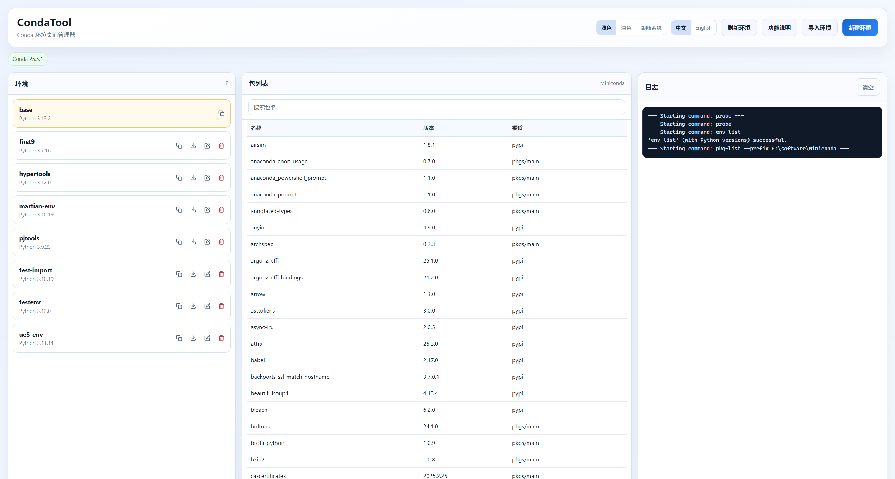

<div align="center">
  <h1>CondaTool</h1>
  <p><strong>A modern desktop GUI for Conda/Miniconda environment management</strong></p>
  <p>基于 Tauri + React + Python，提供更直观的 Conda 环境管理体验。</p>
  
</div>

---

CondaTool 是一个基于 [Tauri](https://tauri.app/) + React + Python 的桌面 GUI 工具，用于管理本机 Conda/Miniconda 环境。  
它面向希望减少命令行操作成本的用户，提供可视化的环境管理、包查看与导入导出能力。

## ✨ 当前功能

- **Conda 自动探测**
- **缺少 Conda/Miniconda 的友好提示**
- **环境管理**：创建、删除、克隆、重命名
- **环境导入/导出**：支持 `yml` / `txt`
- **包列表与搜索**
- **中英文界面切换**
- **浅色/深色/跟随系统主题**
- **实时日志输出**

## 🧩 缺少 Conda 时的行为

当系统中未检测到 Conda/Miniconda 时，应用会弹出安装引导，而不是直接硬错误中断。弹窗内提供官方安装链接，并通过系统浏览器打开。

## 🛠️ 技术栈

- **桌面框架**: Tauri v2
- **前端**: React + TypeScript + Vite
- **后端**: Python（调用本机 `conda` 命令）
- **桥接层**: Rust（Tauri Command + 进程管道）

## 📁 项目结构

- `condatools/src/`：前端 UI
- `condatools/src-tauri/`：Tauri/Rust
- `condatools/backend/`：Python 后端命令封装

## 🚀 本地开发

1. 进入项目目录：
   ```bash
   cd condatools
   ```
2. 安装依赖：
   ```bash
   npm install
   ```
3. 启动开发模式：
   ```bash
   npm run tauri dev
   ```

## 🐍 Python 环境复现

后端入口在 `condatools/backend/main.py`，当前仅依赖 Python 标准库。

1. 创建并激活 Python 环境（示例使用 Conda）：
   ```bash
   conda create -n condatool-dev python=3.12 -y
   conda activate condatool-dev
   ```
2. 安装后端 requirements（目前无第三方包，主要用于统一入口）：
   ```bash
   pip install -r condatools/backend/requirements.txt
   ```
3. 可选：将该 Python 显式绑定给桌面应用（避免系统 Python 混乱）：
   在 `condatools/.env` 中添加：
   ```env
   VITE_CONDATOOL_PYTHON=C:\path\to\python.exe
   ```
4. 重新运行：
   ```bash
   cd condatools
   npm run tauri dev
   ```

## 🔧 调试环境变量（可选）

- `VITE_FORCE_NO_CONDA=1`
  
  强制模拟“未安装 Conda”场景，用于测试安装引导弹窗。

- `VITE_CONDATOOL_PYTHON=绝对路径`
  
  指定后端启动 Python 解释器路径，避免系统 `python` 指向异常解释器（如某些 GIS 内置 Python）。

## 📦 构建

```bash
npm run build
```

如需打包桌面应用：

```bash
npm run tauri build
```

## 🚧 待办事项

- [ ] UI 优化
- [ ] 包安装与卸载（按环境执行）
- [ ] Conda 源管理（查看/新增/删除/优先级调整）
- [ ] 常用源模板（一键切换官方源/社区源）
- [ ] Jupyter Kernel 管理
- [ ] 更完善的错误分级与引导
